# Microprocessor Lab
Microprocessor Lab - Simple examples (the easiest way) with **Proteus** and **CodeVision**.

## Contents

### [FLASHER 1](P01-FLASHER_1.c)
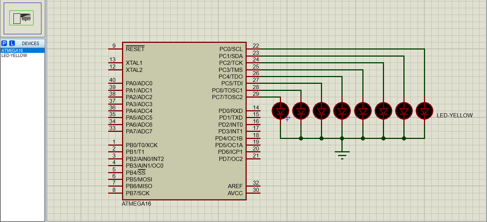

### [FLASHER 2](P02-FLASHER_2.c)

### [FLASHER 0-15](P03-FLASHER_0_15.c)
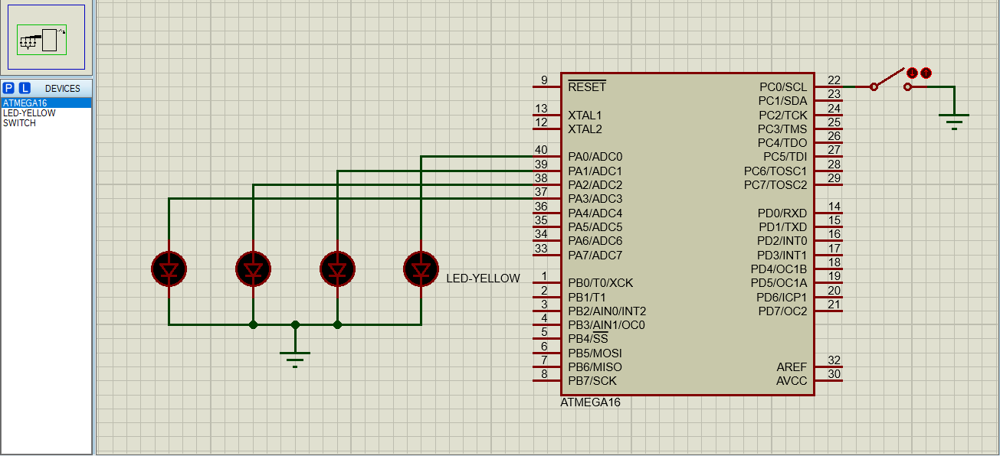

### [SWITCH LED](P04-SWITCH_LED.c)
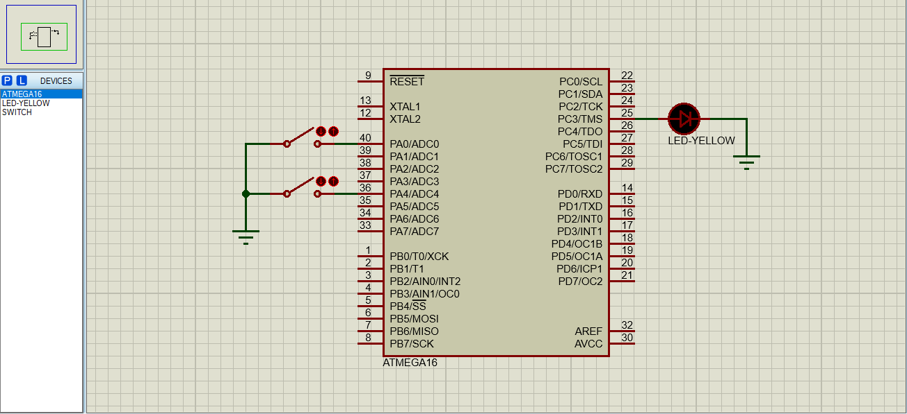

### [FULL ADDER](P05-FULL_ADDER.c)
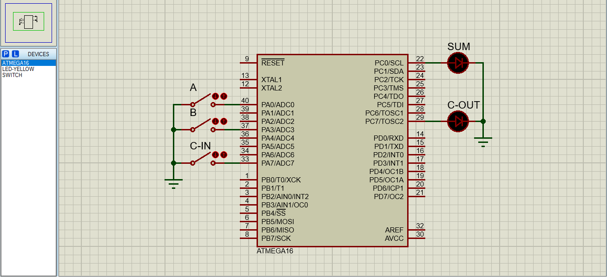

### [7SEG 9 COUNTER](P06-7SEG_9_COUNTER.c)
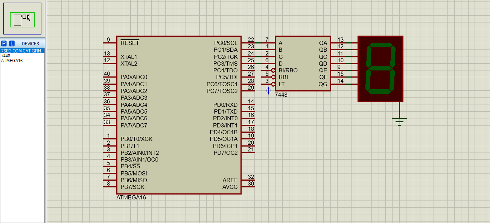

### [7SEG 9 REVERSE COUNTER](P07-7SEG_9_REVERSE_COUNTER.c)

### [7SEG 99 COUNTER](P08-7SEG_99_COUNTER.c)
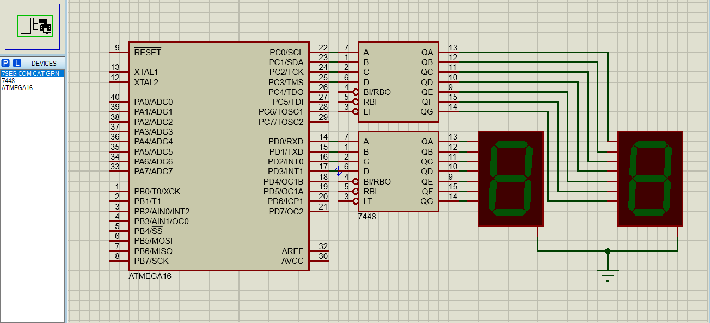

### [7SEG 9 SWITCH x & +](P09-7SEG_9_SWITCH_x_&_+.c)
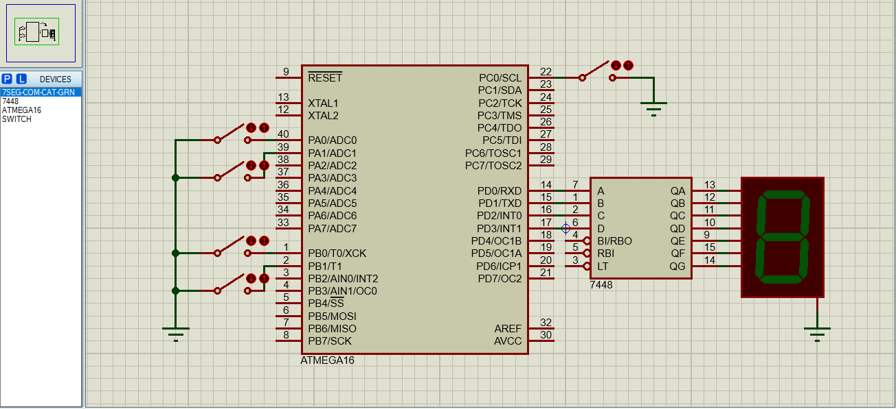

### [LCD CHAR 1](P10-LCD_CHAR_1.c)
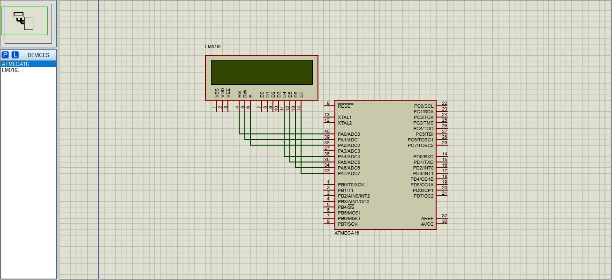

### [LCD CHAR 2](P11-LCD_CHAR_2.c)

### [LCD CHAR SLIDE](P12-LCD_CHAR_SLIDE.c)

### [LCD DIPSWC NUMBER](P13-LCD_DIPSWC_NUMBER.c)
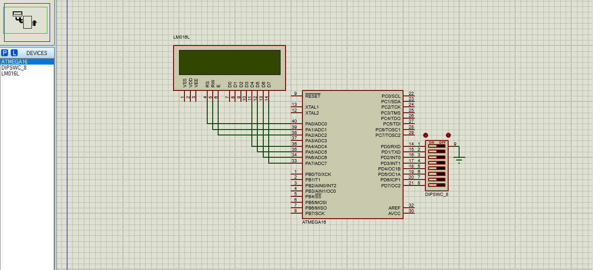

### [LCD DATE CLOCK](P14-LCD_DATE_CLOCK.c)

### [DOT MATRIX A](P15-DOT_MATRIX_A.c)
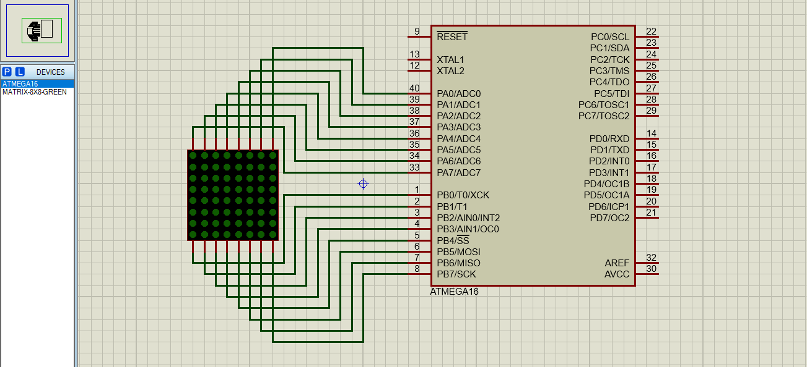

### [BARGRAPH COUNTER 0-255](P16-BARGRAPH_COUNTER.c)
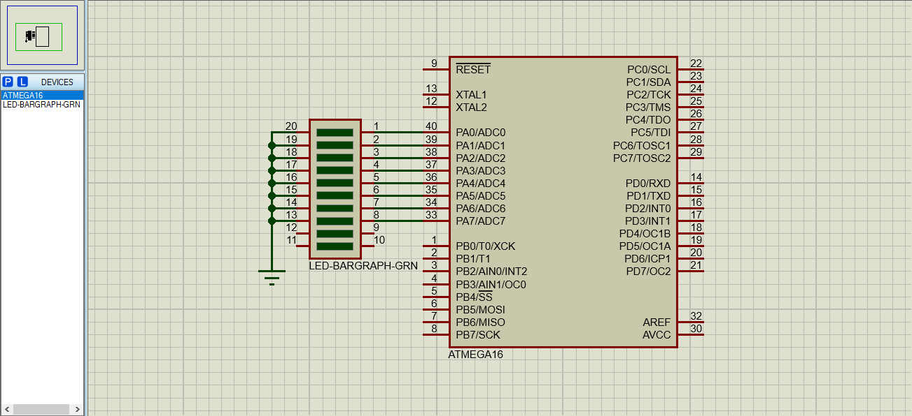

## Contribution
- [Discord](https://discord.gg/2JjvhAk)
